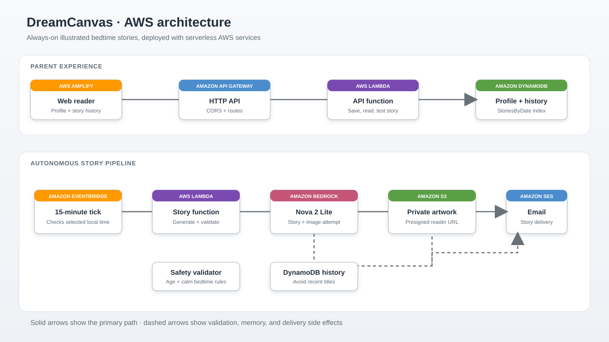
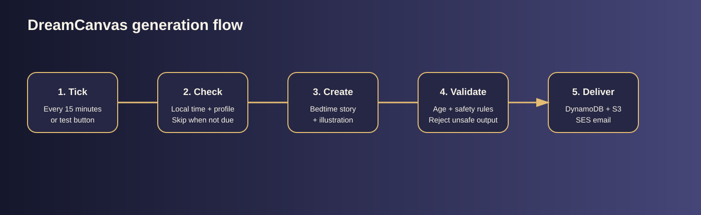

# Weekend Creative Agent Challenge: DreamCanvas

## Vision and what it does

DreamCanvas is an always-on bedtime-story agent for families. Every evening it prepares a fresh short story and matching illustration for a child, then sends the parent an email before bedtime. The parent chooses the child profile, favorite themes, bedtime, and time zone. The default bedtime is 8:00 PM Europe/Stockholm, but the family can select another time in 15-minute increments.

The web reader keeps today’s story and previous stories available. A parent can also choose “Send a test story now” to demonstrate the experience immediately without waiting for the scheduled event. This manual action uses the same profile, Bedrock generation, safety checks, S3 storage, DynamoDB history, and SES email flow as the automated path.

## How it was built

The project uses a serverless design so the story does not depend on a browser being open. The setup page saves one child profile with age, first name, themes, email address, bedtime, and time zone. The generation prompt uses that profile and recent story titles to reduce repetition. It asks for a calm, age-appropriate story with a positive ending and a child-friendly illustration prompt.

Generated output passes a basic safety validator before it is stored or emailed. The image is private in Amazon S3 and the reader receives a temporary signed URL. This keeps the content protected while still allowing the browser to display it.

A key design decision was separating the scheduled path from the manual test path. EventBridge invokes the worker every 15 minutes. The worker checks the selected local time and generates only when the current time matches the saved bedtime. The test action bypasses that time check and is intended for setup, demos, and verification.

## AWS services and architecture

AWS CDK provisions the application. An EventBridge scheduled rule invokes the story Lambda every 15 minutes. The Lambda checks the profile time, calls Amazon Bedrock for text and image generation, stores story records in Amazon DynamoDB, stores illustrations in Amazon S3, and sends the parent email with Amazon SES.

The static frontend is hosted by AWS Amplify Hosting. It calls an Amazon API Gateway HTTP API connected to a second Lambda. The API saves the profile, lists stories, creates presigned S3 image URLs, and exposes the manual test endpoint. IAM grants are separated between the API and story functions.

## What I learned

The most important lesson was that an agent needs an operating rhythm, not only a prompt. Scheduling, local-time handling, persistence, safety checks, email delivery, retries, and a visible reader all matter. I also learned that a manual test path makes an autonomous system easier to trust: a parent can verify the complete experience now and still rely on the scheduled bedtime behavior later. DreamCanvas turns a cloud workflow into a small dependable family ritual.

## Visual walkthrough

The following diagram shows the deployed architecture:

The end-to-end path is intentionally simple. A scheduled tick or a parent test request reaches the story workflow. The profile time is checked in the selected time zone. When the story is due, the worker asks Bedrock for the story, checks the output, creates or falls back to a safe illustration, stores both assets, and sends the email.

This illustration represents the bedtime experience DreamCanvas is designed to create: a child, a friendly panda, and a dog sharing a quiet evening adventure beneath the stars. The generated story image is stored privately and shown to the reader with a temporary URL.

## Running a test story

After saving the profile, the parent can select “Send a test story now.” The API invokes the same story Lambda used by the autonomous workflow, but marks the request as a manual test so it does not wait for the selected bedtime. This gives the builder a fast way to verify Bedrock access, image handling, DynamoDB persistence, S3 storage, and SES delivery. In production, the recurring scheduler remains responsible for the normal evening story.

## Deploying your own copy

Anyone can deploy their own copy using AWS CDK and their own AWS account and profile. The frontend can be hosted with AWS Amplify Hosting, while the API, stories, and images remain in AWS-managed services. Before running the application, configure AWS credentials for the target account, verify the SES sender and recipient when the account is in the SES sandbox, and enable the required Amazon Bedrock model or inference profile in the selected region. The parent then completes their own profile in the app and chooses the child’s themes, bedtime, time zone, and email address.